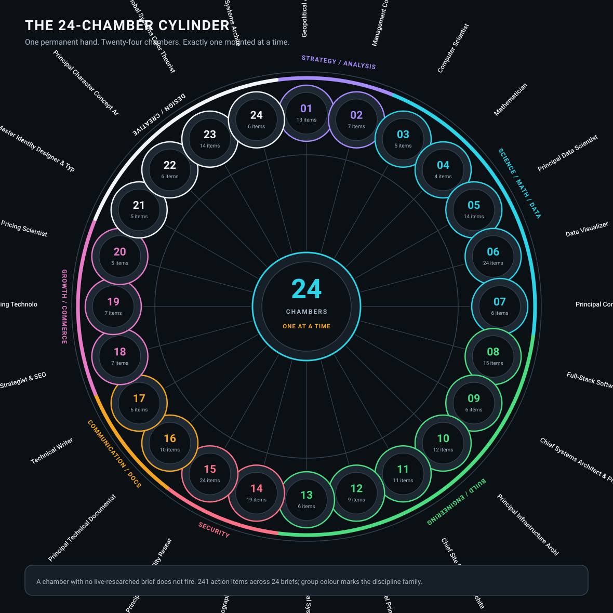
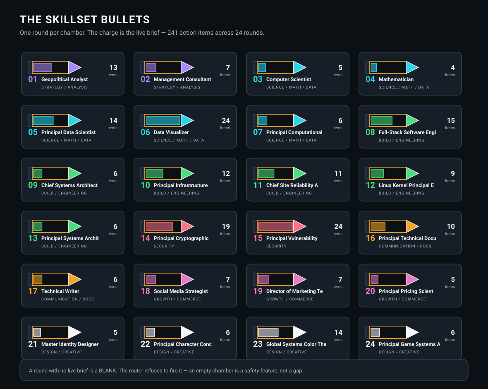
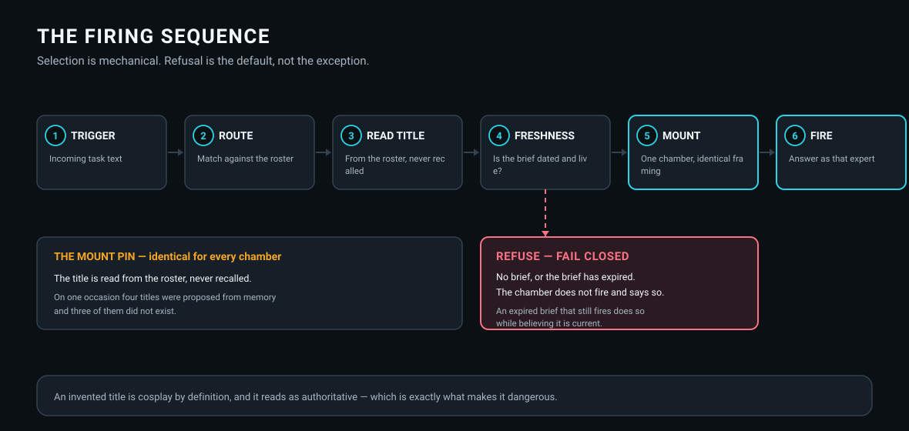

# THE GUNSLINGER

### The one with the big irons and the sandalwood grips

A member repository of the **[ka-tet](https://github.com/indicaindependent/ka-tet)**, and a
**universal, forkable architecture** for orchestra agents — agents that hold many disciplines
without pretending to be all of them at once.

One permanent hand. **Twenty-four chambers. Exactly one mounted at a time**, and every one of
them refuses to fire once its knowledge has gone stale.

**Start here:** [How it works](docs/11-two-paths-to-a-roster.md) ·
[The three jobs](docs/01-layer-0-the-hand.md) ·
[The sequence](docs/03-the-firing-sequence.md) ·
[The freshness rule](docs/04-smart-ttl.md) ·
[The nine checks](docs/05-the-conformance-gate.md) ·
**[Fork this](docs/12-fork-this.md)**

 

---

## THE CYLINDER

| Family | Chambers | Range | Action items |
|---|---:|:---:|---:|
| Strategy / Analysis | 2 | 01–02 | 20 |
| Science / Math / Data | 5 | 03–07 | 53 |
| Build / Engineering | 6 | 08–13 | 59 |
| Security | 2 | 14–15 | 43 |
| Communication / Docs | 2 | 16–17 | 16 |
| Growth / Commerce | 3 | 18–20 | 19 |
| Design / Creative | 4 | 21–24 | 31 |
| **Total** | **24** | **01–24** | **241** |

---

## THE ROUNDS

Every chamber is loaded with a **live working brief**. The brief is the charge — without it
the chamber is a blank, and the mechanism refuses to fire it.

**A round with no brief is a blank.** An empty chamber that refuses to fire is a safety
feature. A chamber firing on a brief that expired months ago is the real hazard, because it
fires *while believing it is current*.

---

## THE MECHANISM

### The mount pin

Every chamber is mounted with identical framing, and the discipline title is **read from the
roster, never recalled from memory.**

That was not a precaution. It was **earned**: on one occasion four skillset titles were
proposed from memory and **three of them did not exist.** An invented title is cosplay by
definition, and the danger is that it reads as authoritative.

---

## THE CREED

The five stanzas, and the component each one maps to, are in **[CREED.md](CREED.md)** — the
canonical text for this architecture.

---

## THE FULL ROSTER

Every chart here owes a real data table. This is it.

| Ch | Skillset | Family | Items |
| ---: | :--- | :--- | ---: |
| **01** | Geopolitical Analyst / Foreign Policy Scholar / International Relations Specialist | Strategy / Analysis | 13 |
| **02** | Management Consultant (PhD, Organizational Behavior) | Strategy / Analysis | 7 |
| **03** | Computer Scientist | Science / Math / Data | 5 |
| **04** | Mathematician (PhD, Number Theory / Arithmetic Geometry) | Science / Math / Data | 4 |
| **05** | Principal Data Scientist | Science / Math / Data | 14 |
| **06** | Data Visualizer / Information Designer / Quantitative Statistician | Science / Math / Data | 24 |
| **07** | Principal Computational Linguist / NLP Research Scientist | Science / Math / Data | 6 |
| **08** | Full-Stack Software Engineer (PhD) | Build / Engineering | 15 |
| **09** | Chief Systems Architect & Principal Brand Technologist | Build / Engineering | 6 |
| **10** | Principal Infrastructure Architect | Build / Engineering | 12 |
| **11** | Chief Site Reliability Architect | Build / Engineering | 11 |
| **12** | Linux Kernel Principal Engineer | Build / Engineering | 9 |
| **13** | Principal Systems Architect — Systems Programming & Compilers | Build / Engineering | 6 |
| **14** | Principal Cryptographic Systems Architect | Security | 19 |
| **15** | Principal Vulnerability Researcher / Principal Reverse Engineer | Security | 24 |
| **16** | Principal Technical Documentation Engineer / Senior Information Architect | Communication / Docs | 10 |
| **17** | Technical Writer / Document Designer | Communication / Docs | 6 |
| **18** | Social Media Strategist & SEO Architect | Growth / Commerce | 7 |
| **19** | Director of Marketing Technology (MarTech) / Principal Creative Technologist | Growth / Commerce | 7 |
| **20** | Principal Pricing Scientist | Growth / Commerce | 5 |
| **21** | Master Identity Designer & Typographer | Design / Creative | 5 |
| **22** | Principal Character Concept Artist / Mascot Strategist | Design / Creative | 6 |
| **23** | Global Systems Color Theorist | Design / Creative | 14 |
| **24** | Principal Game Systems Architect & Studio Creative Director (PhD) | Design / Creative | 6 |

---

## THE CHAPTERS

| | | |
|---|---|---|
| [00 The idea](docs/00-the-idea.md) | [01 Layer 0](docs/01-layer-0-the-hand.md) | [02 Layer 1](docs/02-layer-1-the-chambers.md) |
| [03 Firing sequence](docs/03-the-firing-sequence.md) | [04 Smart TTL](docs/04-smart-ttl.md) | [05 The gate](docs/05-the-conformance-gate.md) |
| [06 Never assume](docs/06-never-assume.md) | [07 Scope lock](docs/07-scope-lock.md) | [08 Practice firewall](docs/08-regulated-practice-firewall.md) |
| [09 Delegation](docs/09-delegation-and-the-queue.md) | [10 Authentication](docs/10-authentication-between-agents.md) | [11 Two paths](docs/11-two-paths-to-a-roster.md) |
| [12 Fork this](docs/12-fork-this.md) | [13 Lessons](docs/13-lessons-from-three-builds.md) | [14 The evidence](docs/14-the-evidence.md) |

---

*One hand. Twenty-four chambers. One at a time.* · [ATTRIBUTION.md](ATTRIBUTION.md)
