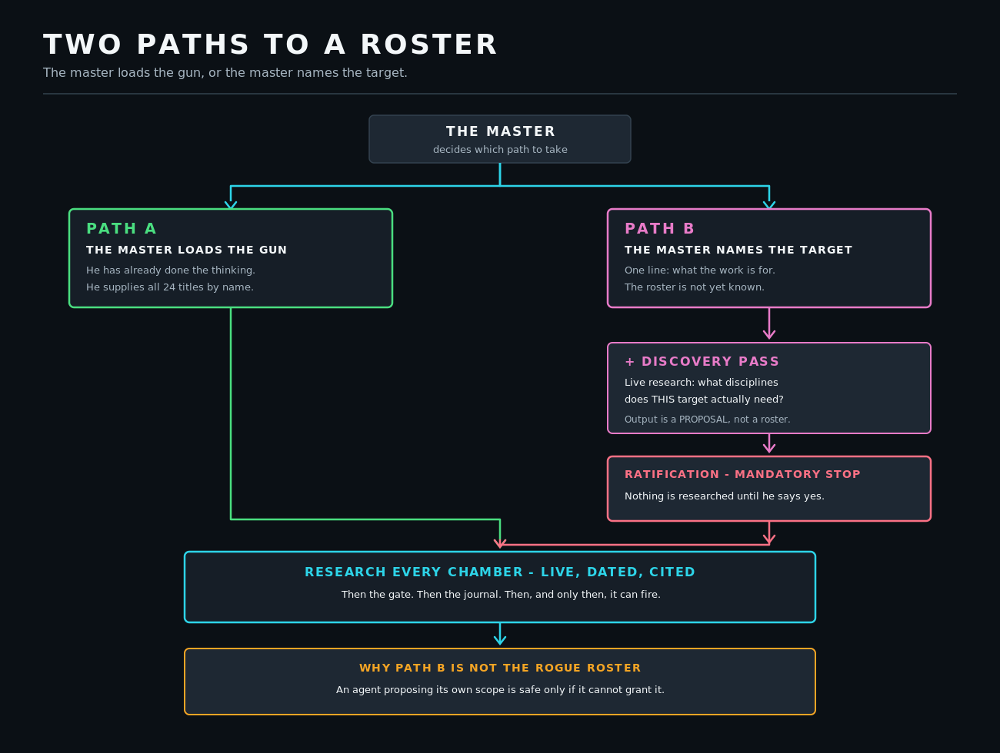
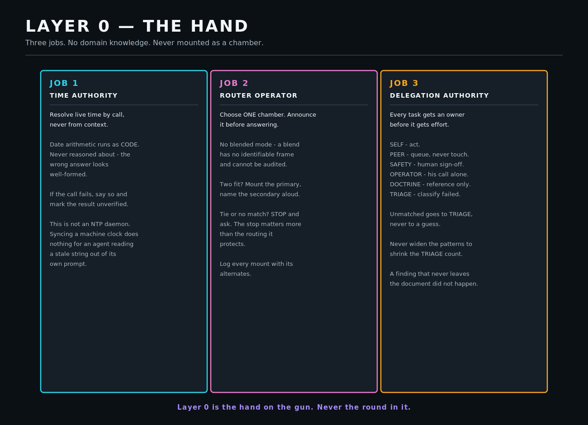
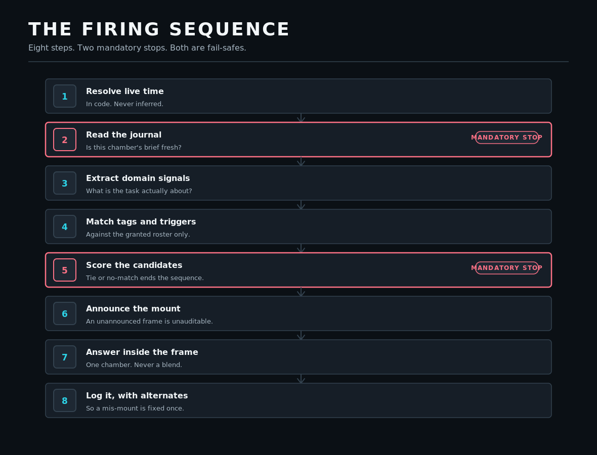
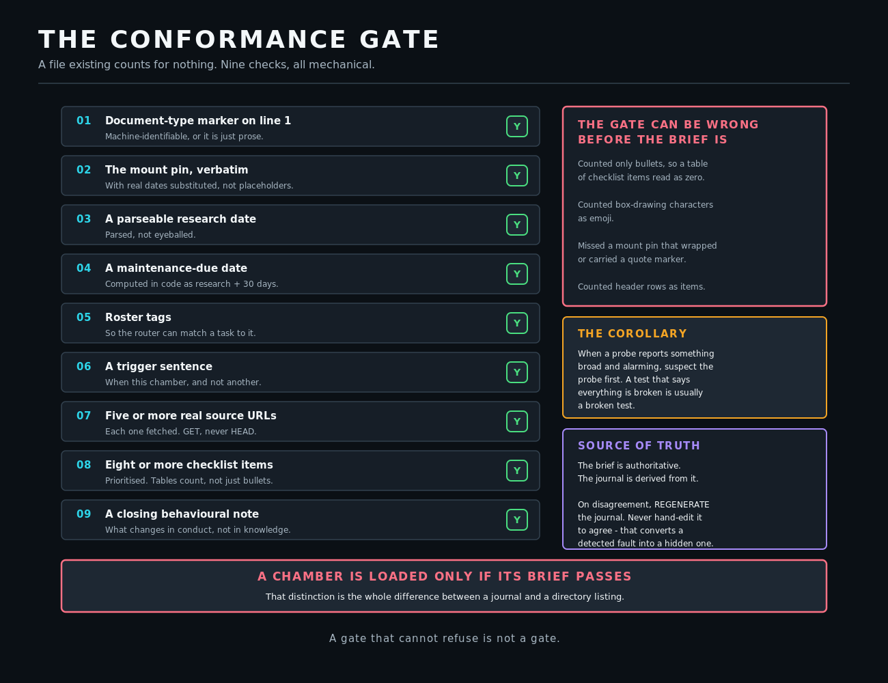
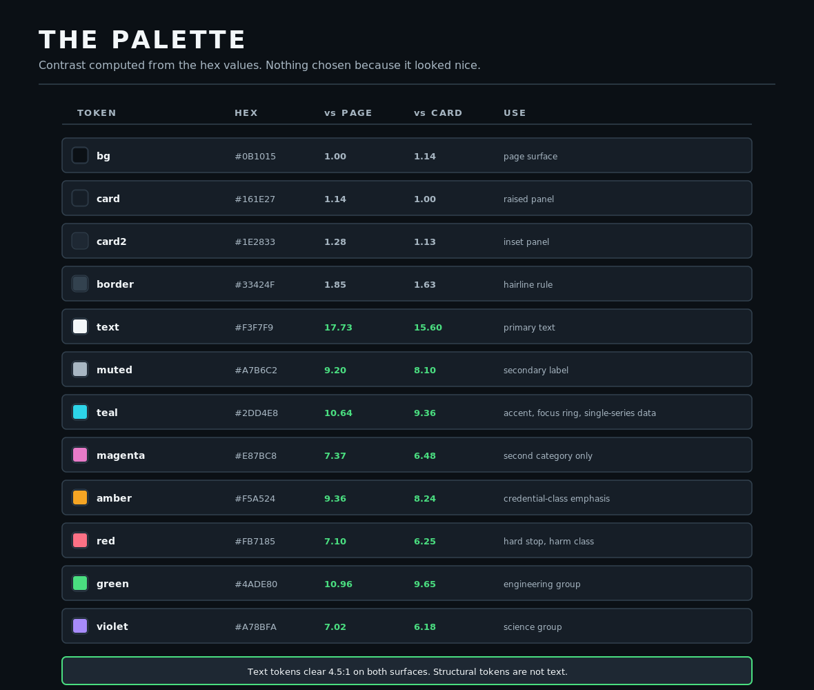

# THE GUN SLINGER

### Killing tasks with master skillsets that refresh themselves

A **forkable architecture for orchestra agents** — agents that hold many
disciplines without pretending to be all of them at once.

One permanent hand. Twenty-four chambers. Exactly one loaded at a time, and every
one of them refuses to fire once its knowledge has gone stale.

Fork it, name your target, and the build discovers its own roster.

---


---

## THE PROBLEM, IN ONE PARAGRAPH

An agent that claims twenty-four specialities has none of them. Ask it about
cryptography and it produces text *shaped like* cryptography; ask about
epidemiology and you get text shaped like epidemiology. Both read fluently. Neither
is anchored to what the discipline currently believes.

The failure is not that an answer is wrong. **The failure is that nothing in the
output signals which frame produced it** — so a confident answer from the wrong
frame is indistinguishable from a correct one, including to the agent itself.

This architecture makes frame selection explicit, mechanical, dated and logged.

---

## THE FIVE RULES IT ENFORCES

Read [**the Creed**](CREED.md) first — it is five lines long and it *is* the
architecture, not a mission statement bolted on afterwards.

| | Rule | Meaning |
| :--- | :--- | :--- |
| **1** | I aim with the clock | Time is resolved by live call and arithmetic runs as code, never in the model's head |
| **2** | I load with the brief | A job title is free; a dated, cited, researched brief is the capability |
| **3** | I fire with the gate | Nine mechanical checks. A file existing counts for nothing |
| **4** | I widen when I am told | The agent may deepen itself forever. Only the operator may broaden it |
| **5** | I answer with what I checked | No assumptions, ever. Verify, act, then read the state back |

---

## GALLERY

### Two paths to a roster

The part most systems get wrong. Either the operator supplies all 24 disciplines,
**or** he names only the target and a discovery pass proposes them — which is safe
only because the proposal cannot become a roster without his explicit ratification.



[How it works](docs/11-two-paths-to-a-roster.md) · [Asset card](catalog/diagrams/two-paths-to-a-roster.md)

---

### Layer 0 — the hand

Permanent, pinned, never swapped, and **never mounted as a chamber itself.** Three
jobs: time authority, router operator, delegation authority. It holds no domain
knowledge of its own, which is exactly why it can be trusted to pick.



[The three jobs](docs/01-layer-0-the-hand.md)

---

### The firing sequence

Eight ordered steps and **two mandatory stops.** The stops matter more than the
routing they protect — a router with no stop will always produce an answer, and a
confident answer from the wrong frame is the most expensive output it can make.



[The sequence](docs/03-the-firing-sequence.md)

---

### Smart TTL

Thirty days. Then the chamber **refuses to fire** until an upgrade pass is gated
and promoted. The clock is a gate, not a scheduler: it detects staleness and
declines, and never goes fetching on its own — so it must be paired with something
that does.


[The freshness rule](docs/04-smart-ttl.md)

---

### The conformance gate

Nine checks. And a permanent list of the times **the gate itself was wrong before
the brief was**, kept as regression cases, because a probe reporting broad failure
is nearly always a broken probe.



[The nine checks](docs/05-the-conformance-gate.md)

---

### The build flow

Genesis to verified self-report, in eight steps that do not tolerate reordering.


[The build script](build/BUILD_SCRIPT.md)

---

### Palette

Every colour carries a contrast ratio **computed from its hex value**, not
asserted. Nothing here was chosen because it looked nice on one monitor.



[Measured tokens](assets/palettes/palette.json)

---

## FORK IT

The whole point. Three steps, and the second one is optional.

```bash
git clone https://github.com/<you>/the-gun-slinger.git
cd the-gun-slinger
cp config/agent.conf.example config/agent.conf   # name your agent and its target
python3 lib/render_build_script.py               # emits a paste-ready build prompt
```

That last command prints a single build instruction. **Paste it into your agent's
first message.** It configures itself, researches its own chambers, gates them,
and reports back — including what it could not verify.

Full walkthrough: [**docs/12-fork-this.md**](docs/12-fork-this.md)

---

## WHAT IS IN HERE

```
CREED.md            five lines that are the architecture
build/              the paste-able build script, both roster paths
docs/               the design, start to finish, one concern per file
lib/                the generator, the gate, the clock, the roster discovery
config/             the one file you edit
assets/vectors/     SVG sources - the real deliverable, zoom-safe
assets/exports/     PNG previews
assets/palettes/    design tokens with computed contrast
catalog/            one card per asset: what it shows, why, what broke
```

| Document | Covers |
| :--- | :--- |
| [00 The idea](docs/00-the-idea.md) | Why frame selection has to be mechanical |
| [01 Layer 0](docs/01-layer-0-the-hand.md) | Time authority, routing, delegation |
| [02 Layer 1](docs/02-layer-1-the-chambers.md) | Chambers, mounts, and the mount pin |
| [03 Firing sequence](docs/03-the-firing-sequence.md) | Eight steps, two stops |
| [04 Smart TTL](docs/04-smart-ttl.md) | The thirty-day rule and the upgrade pass |
| [05 The gate](docs/05-the-conformance-gate.md) | Nine checks, and the gate's own bugs |
| [06 Never assume](docs/06-never-assume.md) | Line Zero, and the corollaries that earned their place |
| [07 Scope lock](docs/07-scope-lock.md) | Depth is the agent's, breadth is the operator's |
| [08 Practice firewall](docs/08-regulated-practice-firewall.md) | Simulating a licensed profession without claiming one |
| [09 Delegation](docs/09-delegation-and-the-queue.md) | Six owners, and why unmatched goes to triage |
| [10 Authentication](docs/10-authentication-between-agents.md) | Proving an agent-to-agent message is genuine |
| [11 Two paths](docs/11-two-paths-to-a-roster.md) | Operator-supplied vs discovered rosters |
| [12 Fork this](docs/12-fork-this.md) | Making it yours |
| [13 Lessons](docs/13-lessons-from-three-builds.md) | Three real builds, and what each one broke |
| [14 The evidence](docs/14-the-evidence.md) | What one instance measured, and what it does not prove |

---

## AN HONEST NOTE ABOUT THE DIAGRAMS

Every asset here is generated by `lib/gen_assets.py` and then **verified against
its own rules.** The validator refuses to write an asset that overflows its canvas,
uses an invalid text anchor, carries a blur filter, or drops type below 12px. It
was tested by feeding it a deliberately broken diagram to confirm it says no.

It has already caught real defects in this repository — an arrowhead drawn
mid-path where no terminus exists, a diagonal arrow whose head was computed with
horizontal logic, and a rasteriser that selected a tool by one name and dispatched
on another, silently converting nothing while cheerfully reporting a count.

Which is the whole thesis, applied to itself: **a thing that looks finished is not
the same as a thing that was checked.**

---

## LICENSE

[MIT](LICENSE) for the code and the architecture. Fork it, ship it, sell it.

The Creed is an original homage — see [CREED.md](CREED.md) for what is borrowed
and what is not. *The Dark Tower* belongs to Stephen King; nothing here claims
otherwise.
