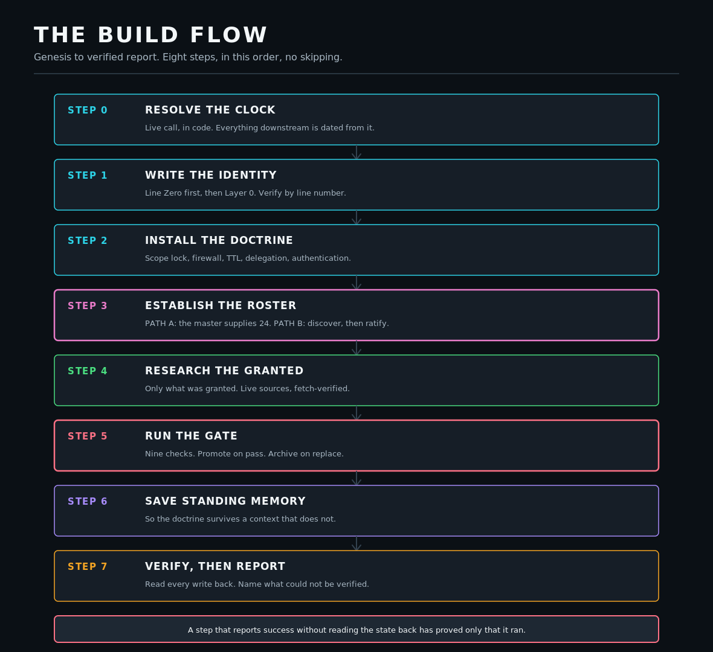

# BUILD FLOW

**Genesis to verified report**

| | |
| :--- | :--- |
| Vector | [`assets/vectors/diagrams/build-flow.svg`](../../assets/vectors/diagrams/build-flow.svg) |
| Raster | [`assets/exports/build-flow.png`](../../assets/exports/build-flow.png) |
| Canvas | 1180 x 1080 |
| Type range | 13px - 36px |
| Text nodes | 27 |
| Solid background | yes |
| Blur filters | none |
| Accessible title + desc | yes |

## WHAT IT SHOWS

The eight build steps in required order, with the roster fork at step three and the gate at step five.

## DESIGN NOTE

Steps that can halt the build are stroked at 2.5 rather than 1.5. The footer states the rule the whole sequence exists to enforce.

---

Regenerate with `python3 lib/build_diagrams.py`. The generator refuses to write an
asset that overflows its canvas, uses an invalid text anchor, carries a blur filter,
or drops type below 12px.
