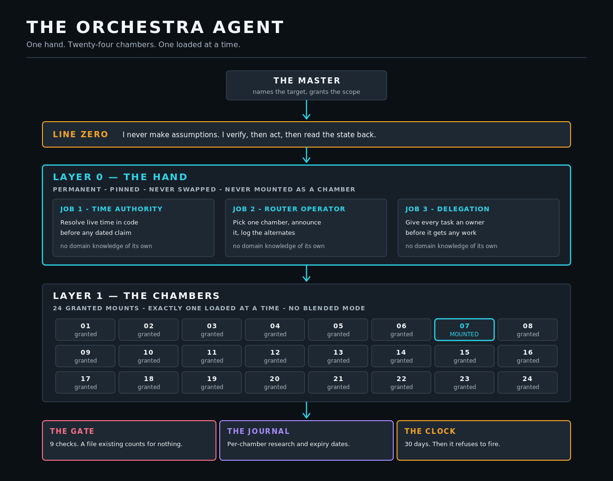

# ORCHESTRA ARCHITECTURE

**The whole system on one canvas**

| | |
| :--- | :--- |
| Vector | [`assets/vectors/diagrams/orchestra-architecture.svg`](../../assets/vectors/diagrams/orchestra-architecture.svg) |
| Raster | [`assets/exports/orchestra-architecture.png`](../../assets/exports/orchestra-architecture.png) |
| Canvas | 1300 x 1020 |
| Type range | 12px - 36px |
| Text nodes | 76 |
| Solid background | yes |
| Blur filters | none |
| Accessible title + desc | yes |

## WHAT IT SHOWS

The master names a target. Line Zero sits above everything. Layer 0 holds three permanent jobs and is never mounted as a chamber. Layer 1 holds the granted mounts with exactly one live. The gate, journal and clock sit underneath as the machinery that decides whether a chamber may fire at all.

## DESIGN NOTE

The 24-cell grid is drawn from a loop rather than hand-placed, so the count can never disagree with the label above it. One cell is highlighted to make 'exactly one loaded' visible rather than merely stated.

---

Regenerate with `python3 lib/build_diagrams.py`. The generator refuses to write an
asset that overflows its canvas, uses an invalid text anchor, carries a blur filter,
or drops type below 12px.
