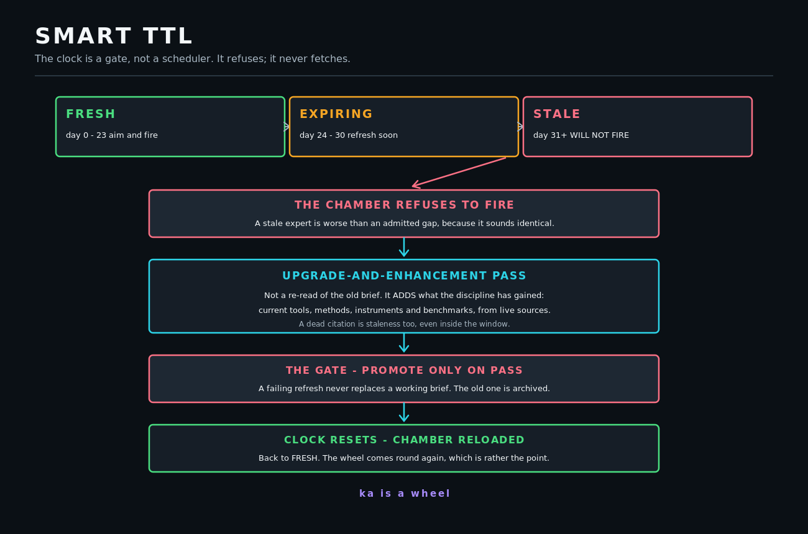

# SMART TTL LIFECYCLE

**The freshness gate**

| | |
| :--- | :--- |
| Vector | [`assets/vectors/diagrams/smart-ttl-lifecycle.svg`](../../assets/vectors/diagrams/smart-ttl-lifecycle.svg) |
| Raster | [`assets/exports/smart-ttl-lifecycle.png`](../../assets/exports/smart-ttl-lifecycle.png) |
| Canvas | 1300 x 860 |
| Type range | 12px - 36px |
| Text nodes | 19 |
| Solid background | yes |
| Blur filters | none |
| Accessible title + desc | yes |

## WHAT IT SHOWS

Fresh, expiring, stale, refusal, upgrade pass, gate, promotion, and the clock reset. The refusal is drawn as a full-width stop because it is a behaviour, not a status.

## DESIGN NOTE

The diagonal connector from STALE to the refusal box needed a dedicated diag() primitive - the straight arrow() branches on vertical-versus-horizontal and drew a horizontal head on a sloped line.

---

Regenerate with `python3 lib/build_diagrams.py`. The generator refuses to write an
asset that overflows its canvas, uses an invalid text anchor, carries a blur filter,
or drops type below 12px.
